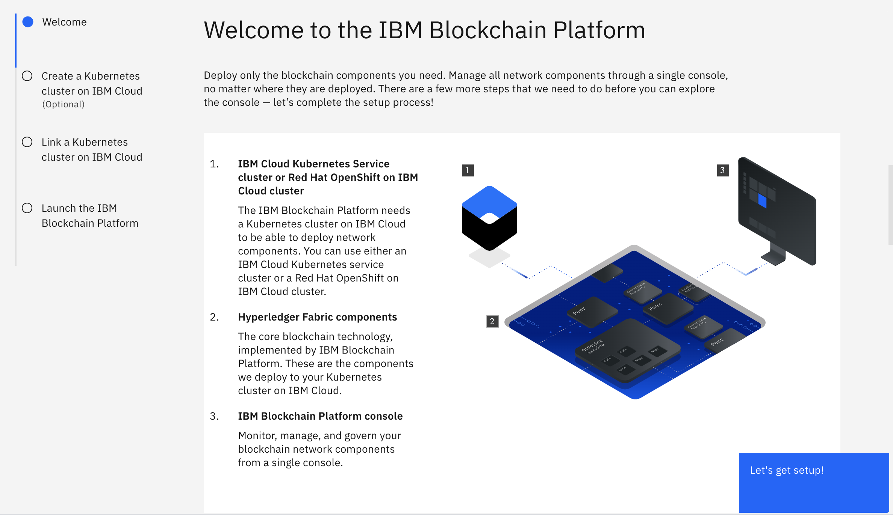

##  HvA Blockchain Architecture :: Practicum

An article published by Forbes in 2022 called [Blockchain 50: Billion Dollar Babies](https://www.forbes.com/sites/michaeldelcastillo/2022/02/08/forbes-blockchain-50-2022/?sh=3534811e31c6) shows which platforms these companies are using in their projects. The top three platforms are Ethereum, Hyperledger Fabric and Bitcoin. 

Given the relevance of Hyperlerdger Fabric in the private blockchain market, this workshop is dedicated to this platform. We demo how to host the blockchain network in the cloud by using the [IBM Blockchain Platform](https://cloud.ibm.com/docs/blockchain?topic=blockchain-get-started-ibp). This platform creates a Hyperledger Fabric network on an IBM Kubernetes Service. The operator can configure peers, install and instantiate the smart contract on the network via the console.

## Objectives

- Deploy a private blockchain network in the cloud

## Prerequisites

This time, the whole Blockchain will be hosted in the cloud. Thus, the local requirements are minimal and similar to previous exercises, except for docker.

## The Use Case

The proposed use case is a simplified supply-chain process. An association of farmers, shippers and food distributors decided to optimise their businesses, creating a consortium. The consortium uses a private permissioned blockchain network to do its business.

To know more, go to the [use case section of the previous workshop](https://gitlab.fdmci.hva.nl/blockchain/architecture/bc2-arch-week-3)

## Network Configuration

### Cloning the project

Start by cloning the workshop project.

```
git clone git@gitlab.fdmci.hva.nl:blockchain/architecture/bc2-arch-week-6.git
```

Open the project folder using your preferred editor (e.g. VS Code)

### How to get a free IBM Cloud account

1. If you do not have an IBM account, create one using [this link](https://cloud.ibm.com/registration)
2. [Log in](https://cloud.ibm.com/login) to your IBM Cloud account
3. Once you see your IBM Cloud dashboard, click on "Upgrade Account" in the top-right corner under your Account name. 
4. Enter Credit Card info, and click submit.
5. This will give you $200 in free IBM Cloud account credit to use in 30 days.
6. Follow the instructions to create a free classic Kubernetes cluster [here](https://cloud.ibm.com/docs/containers?topic=containers-getting-started#clusters_gs)
7. Wait for around 20 minutes as your cluster is deploying. :
8. After your cluster is deployed, access the catalog and select the "Blockchain Platform". Choose the location, the "standard" pricing plan, and click "Create". 
9. From your IBM Cloud dashboard, click on your IBM Blockchain Platform service. From there, when it asks you to deploy to a cluster, choose your free cluster. Once your deployment is finished, you can now access your IBM Blockchain platform account!

### Configuring the blockchain network



The sequence of steps to have the network up and running is the following:

2. Link the blockchain network with the already created Kubernetes Cluster
    > It takes a couple of minutes to link the blockchain platform to the cluster. Click on the button to launch the platform when ready.
4. You will see a welcome screen. Proceed with the get started button. 
    > Then, you will be redirected to the control panel.
5. Add certificate authorities (ca-org1, ca-org2, ca-orderer)
    > We suggest you create a simple and easy to remember *enrol ID* and secret (e.g. admin/adminpw)
5. Associate identities with each ca
    > You can associate the previously created admin identity to each CA by clicking on the ca and clicking the "Associate identity" button.
6. Create peers' and orderer users per CA
    > Peers and orderer services connect to the network by using a specific certificated issued by the CA. For example, create an enrol ID/secret peer0/peer0pw of type peer for peer0.org1. 
6. Create MSP definitions for org1, org2, and orderer
    > You can create them from the "Organizations" menu option. For example Org1/Org1MSP, Org2/Org2MSP, Orderer/OrdererMSP. You can link them with their existing CA's and identities.
7. Create peers
    > For example, peer0.org1, peer0.org2. These peers should use CouchDB as a state database. You can associate the peer with their corresponding CA's, MSP's and enroll ID's. Select HLF versions 2.x.
8. Create the ordering service.
    > You can associate the orderer with their corresponding CA's, MSP's, and enrol ID's.
8. Add organisations to the consortium
    > You can add Org1MSP and Org2MSP as part of the consortium from the orderer panel.
9. Create a channel
    > Your channel should follow the new HLF 2.x workflow for the deployment of smart contracts. Please check the "advanced channel configuration". Channel name should be "mychannel". Make both Org1 and Org2 the operators of the channel. Select application and orderer capability version 2.0.0 or higher. 
    > You should follow the approval workflow. Stay tuned to the notification bar.
10. Join peers to the channel
11. Install smart contract
    > Hint 1: To propose a smart contract definition, you should specify the contract package with the .tar.gz format. To generate the file use the following command: `peer lifecycle chaincode package egg-tracking-contract.tar.gz --path [base-folder]/bc2-arch-week-6/contract --lang node --label egg-tracking-contract-v1`

    > Hint 2: The `peer` command is located in the `bin` folder of the `fabric-samples` installation. Make sure to add this folder to the PATH variable of your console.
    
    > Hint 3:
    Make sure that the FABRIC_CFG_PATH is pointing to the correct folder of the fabric configuration (core.yaml). For example, `export FABRIC_CFG_PATH=~/fabric-samples/config` 

12. Run the workflow steps to approve and commit the smart contract definition
13. Download connection profile (via MSP). You can choose Org1MSP.
15. Add the downloaded file (e.g. Org1MSP_profile.json) to the *client/backend* folder
16. Open the *Org1MSP_profile.json* and change the label of the *certificateAuthorities* value to "ca". 
    > Usually, this value is a dynamic IP address, and should be a static label that is used by the client app. See config.json, field *caName*.

## Interacting with the blockchain

The network participants invoke smart contracts by using a client. The client, in turn, is responsible for submitting the transaction to peers. 

We built a client that exposes a RESTful API to interact with a blockchain network. This approach is quite useful if you have a variety of clients like web applications, mobile applications, and IoT devices. Now we are examining how a typical web application can interact with a Hyperledger Fabric network.


### Installing client dependencies 

First, you should install the dependencies.

Using the terminal window, execute the following command in the **client/backend** folder:

```
npm --logevel=error install
```

This command installs all dependencies in the *node_modules* folder.

### Adding the first user to the wallet

The administrator of an organisation can issue certificates to new users. You need an admin certification to create the participants of the egg tracking network such as farmers, distributors and shippers. Thus, you should export the admin certificate to the **client/backend/wallet** folder. To do so, execute the following operation:

```
node src/enrollAdmin.js
```

This command logs in to the certificate authority of organisation 1 and download the certificate of the administrator of org1, and add it to the *wallet* folder. 

Note: If you rerun this command, you should manually remove the previous certificate file of the admin user(*admin.id*). Otherwise, the system throws an error message informing that the certificate already exists.

Now you are ready to run the application.

### Running the client

To start the server use the following command:

```
npm start
```

It starts a server running on port 8080. To interact with the API, we recommend you using Postman (see the prerequisites section).

To speed up your tests, you can import the following collection with all ready-made calls from Postman :

```
https://www.getpostman.com/collections/f79a652a8fce80225492
```

### Using the Client API

We have build a simple frontend application to demonstrate how event handling can be managed in the client-side.

You should install Angular first. If you do not have it yet, run the following command in your terminal:

```
npm install -g @angular/cli
```

More information about the Angular environment can be [found here](https://angular.io/guide/setup-local).

To run the application, you should first install dependencies in the root folder of the frontend application.

```.
npm --logevel=error install
```

Then, you can start a local server, by running this command in the root folder of the frontend application.

```
ng serve
```

After start-up you can access the application from [http://localhost:4200](http://localhost:4200).

You can see packaging, loading, shipment events on the screen. The client is only reading data. Thus, you should use Postman in parallel to execute the transactions.
