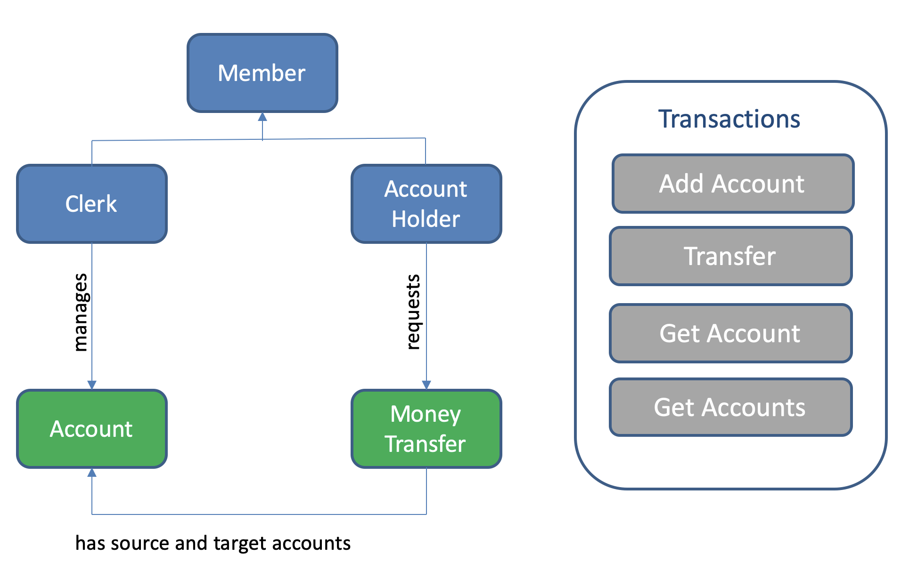
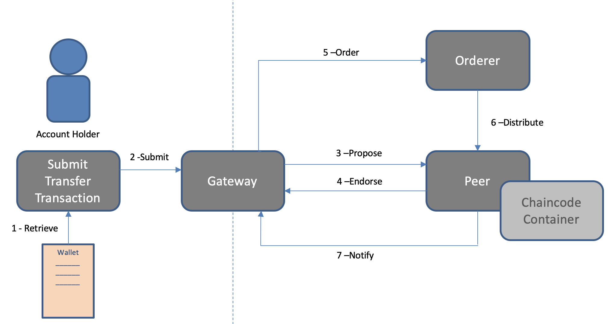

##  Blockchain Architecture :: Practicum

This project aims at presenting an implementation of a permissioned blockchain network using Hyperledger Fabric version 2.5. This tutorial was build based on the official documentation of Hyperledger that [can be found here](https://hyperledger-fabric.readthedocs.io/en/latest/test_network.html). 


## Objectives

- Understand the basics of a Hyperledger Fabric network configuration and deployment
- Understand the basics of chaincode development lifecycle
- Build chaincode using the Fabric contract API
- Interact with the network by using the Fabric Contract API

## Prerequisites
You must have the Hyperledger Development Environment configured in your machine or a spare VM. If you do not have it yet, you can follow the instructions:

* Prerequisites (installation of cURL, Docker and Docker Composer, GO, NodeJS (v18), Python, Git): [link](https://hyperledger-fabric.readthedocs.io/en/latest/prereqs.html)
    * For NodeJS/NPM I would recommend using the **nvm** tool to manage the variety of versions automatically
* Install Samples, Binaries, and Docker Images: [link](https://hyperledger-fabric.readthedocs.io/en/latest/install.html)

Alternatively, you can use a ready-to-use Linux Virtual Machine running on VirtualBox. More information can be found [here](./VM.md)

## The Use Case

The proposed use case is about money transfer between accounts. One participant, account holder A, transfers money to account holder B.


## Network Configuration

### Creating the Fabric network

During this step, you will create a local Fabric network based on the *test-network*. This network is deployed with Docker Compose. 

To get started, you should first clone this project into your local computer.
```

1. Open a terminal screen

2. Go to `fabric-samples/test-network` folder, generally installed in the home folder of your file system

3. Execute the following command to create and start the network: 

```
./network.sh up -ca -s couchdb
```

This command creates a Fabric network that consists of one ordering node, two organisations, two peers (one per organisation), certificate authorities per organisation and orderer. The -s couchdb option enables the CouchDB database per peer. If the command completes successfully, you will see the logs of the nodes being created. 

Note: At any time, you can stop the network by running `./network.sh down`. At the time of writing this tutorial, the Docker desktop version is 4.7.0. If the script is taking too long to finish, try to restart Docker.

### Understanding the network

Take some time to examine the running components. You should see few nodes that were created by the `network.sh` script:

```
docker ps -a
```

Peers and users that interact with a HLF network must belong to one of the organisations. The group of organisations that are members of a HLF network are often referred to as the __consortium__. 

The figure below illustrates the consortium components:


Peers are the fundamental components of any Fabric network. They store the blockchain ledger and validate transactions before they are committed to the ledger. Some peers run smart contracts containing the business logic used to manage the assets on the blockchain ledger.

Every peer in the network belongs to a member of the consortium. In this network, each organisation operates one peer each, peer0.org1.example.com and peer0.org2.example.com.

Every Fabric network also includes an ordering service. While peers validate transactions and add blocks of transactions to the blockchain ledger, they do not decide on the order of transactions or include them into new blocks. On a distributed network, peers may be running far away from each other and not have a common view of when a transaction was created. Reaching consensus on the order of transactions is a costly process that would create overhead for the peers.

An ordering service allows peers to focus on validating transactions and committing them to the ledger. After ordering nodes receive endorsed transactions from clients, they reach a consensus on the order of transactions and then add them to blocks. The blocks are then distributed to peer nodes, which add the blocks to the blockchain ledger. Ordering nodes also operate the system channel that defines the capabilities of a Fabric network, such as how blocks are made and which version of Fabric that nodes can use. The system channel defines which organisations are members of the consortium.

This network uses a single node Raft ordering service that is operated by the ordering organisation. You can see the ordering node running on your machine as orderer.example.com. While the test network only uses a single node ordering service, a real network would have multiple ordering nodes, operated by one or multiple orderer organisations. The different ordering nodes would use the Raft consensus algorithm to agree on the order of transactions across the network.

### Creating a channel

Now that we have peer and orderer nodes running on our machine, we can use the script to create a Fabric channel for transactions between Org1 and Org2. Channels are a private layer of communication between specific network members. Channels can be used only by organisations invited to the channel, and are invisible to other members of the network. Each channel has a separate blockchain ledger. Organisations invited “join” their peers to the channel to store the channel ledger and validate the transactions on the channel.

You can use the network.sh script to create a channel between Org1 and Org2 and join their peers to the channel. Run the following command to create a channel with the default name of mychannel:

```
./network.sh createChannel
```

This command will create the channel *mychannel* in the network. It is also possible to create other channels with custom names. For this exercise, one channel is sufficient.

## Chaincode

### Use Case

After you have created a channel, you can start using smart contracts to interact with the channel ledger. Smart contracts contain the business logic that governs assets on the blockchain ledger. Applications run by members of the network can invoke smart contracts to create assets on the ledger, as well as change and transfer those assets. Applications also query smart contracts to read data on the ledger.

This use case is about current account management, as can be seen in the figure below:



Blue boxes represent participants that interact with the network at some point. Green boxes represent assets. An account is an asset that belongs to a participant. A money transfer is an action, but it is also proof that the transfer was made, also becoming an asset in this context. Elements in grey are the transactions available for the smart contract.

### Deploying the chaincode

Transactions created using smart contracts typically need to be signed by multiple organisations to be committed to the channel ledger. Multiple signatures are integral to the trust model of Fabric. Requiring multiple endorsements for a transaction prevents one organisation on a channel from tampering with the ledger on their peer or using business logic that was not agreed to. To sign a transaction, each organisation needs to invoke and execute the smart contract on their peer, which then signs the output of the transaction. If the output is consistent and has been signed by enough organisations, the transaction can be committed to the ledger. 

The policy that specifies the set organisations on the channel that need to execute the smart contract is referred to as the endorsement policy, which is set for each chaincode as part of the chaincode definition.

In Fabric, smart contracts are deployed on the network in packages referred to as **chaincode**. A Chaincode is installed on the peers of an organisation and then deployed to a channel, where it can then be used to endorse transactions and interact with the blockchain ledger. Before a chaincode can be deployed to a channel, the members of the channel need to agree on a chaincode definition that establishes chaincode governance. When the required number of organisations agree, the chaincode definition can be committed to the channel, and the chaincode is ready to be used.

After you have used the network.sh to create a channel, you can deploy a chaincode on the channel, using the following steps command:

1. Go to `fabric-samples/test-network`
2. Execute the following command:

```
./network.sh deployCC -ccn acc-mgmt -ccp [base-folder]/bc2-arch-week-1/chaincode -ccv 1 -ccl javascript
```

Where [base-folder] is the location where you cloned this project, `acc-mgmt` is the name of the chaincode, the parameter *-ccl javascript* is the language used to write the chaincode. This example was built with javascript. The parameter *-ccv 1* is the version. If you change something in your chaincode and wants to redeploy, you should increment this value.

The deployCC subcommand will install the account management chaincode on peer0.org1.example.com and peer0.org2.example.com and then deploy the chaincode on the channel specified using the channel flag (or mychannel if no channel is specified). If you are deploying a chaincode for the first time, the script will install the chaincode dependencies. 

You can find the account management chaincode in the chaincode folder of this project. After the report management chaincode definition has been committed to the channel, the script initializes the chaincode by invoking the init function. The script then queries the chaincode to check if the execution was successful. 

You should install your smart contract before it can be invoked by applications. Administrators can install the contract onto peers over which they respectively have authority.

## Client Interaction

After you bring up the test network, you can use the *peer* CLI to interact with your network. The *peer* CLI allows you to invoke deployed smart contracts, update channels, or install and deploy new smart contracts from the CLI. For this tutorial, we are concentrating on client interaction and the interaction using the *peer* CLI will be covered in another session.

In this example, the smart contract is called by the account holder. The client uses this application to submit a transaction to the ledger, which executes a fund transfer - the figure below illustrates how the application works.



A gateway component allows an application to focus on transaction generation, submission and response. It coordinates transaction proposal, ordering and notification processing between the different network components.

Because the issue application submits transactions on behalf of the client, it starts by retrieving the X.509 certificate from her wallet, which might be stored on the local file system or a Hardware Security Module HSM. The issue application is then able to utilize the gateway to submit transactions on the channel. The Hyperledger Fabric SDK provides a gateway abstraction so that applications can focus on application logic while delegating network interaction to the gateway. Gateways and wallets make it straightforward to write Hyperledger Fabric applications.

So let’s examine the application:

1. We assume that you are in the *test-network* folder of fabric
2. Go to the *client* folder of this project
3. Install the project libraries using `npm --logevel=error install`. This command will install the libraries required to run the client. To know more about the required libraries, take a look at the file *package.json*

### Getting connection information

We connect clients to the HLF network through the gateway. A gateway needs more information to connect. For example, at least one peer with IP address and port information. Thus, a connection profile is the most common way to provide information to the gateway. 

To know a bit more about the connection profile, take a look at the one created in the test-network in the following path:

```
fabric-samples
    test-network
        organisations
            peerOrganisations
                org1.example.com
                    connection-org1.json
```

Our client programs are using this file to connect to the blockchain network. Thus, it needs to know the location of HLF files. All programs are using the `FABRIC_PATH` variable.

Thus, by using your terminal, you should create the variable FABRIC_PATH pointing to the folder of your fabric-samples, for example:

```
export FABRIC_PATH=~/fabric-samples
```

### Adding the admin certificate to your wallet

The following command will create a certificate for the admin user.

Go to `[base-folder]/bc2-arch-week-1/client` and run the following command:

```
node enrollAdmin.js
```

Take some time to:
1. examine the source code
2. see the generated content of the wallet folder

### Adding a regular user to your wallet

The following command will create a certificate for a regular user.

```
node registerUser.js
```

Take some time to:
1. examine the source code
2. see the generated content of the wallet folder

### Creating some accounts

The following command will create two accounts:

```
node invoke.js
```

Take some time to:
1. examine the source code
2. Query the world-state stored in a CouchDB database [using the Fauxton interface](http://localhost:5984/_utils/). Default user/password is admin/adminpw.

### Querying the ledger

The following command will retrieve all accounts

```
node query.js
```

Take some time to:
1. examine the source code
2. Understand the difference between submitted queries and transactions

### Money Transfer

Create a new file in the client folder called "transfer.js" that makes a money transfer between the accounts NL1724 and NL1732. You should execute two types f test:

1. The sender has enough money to proceed with the transfer
2. The sender does not have enough money to proceed with the transfer

### Limitations

There are many limitations of the provided example. Some of them:
- The application is not checking the user's authority: Is the current user the owner of the account or an authorised clerk?
- The entities that represent account, account holder, transfer are loosely defined
- The transfer transactions are registered in the ledger, but they are not user-friendly, user-readable.

