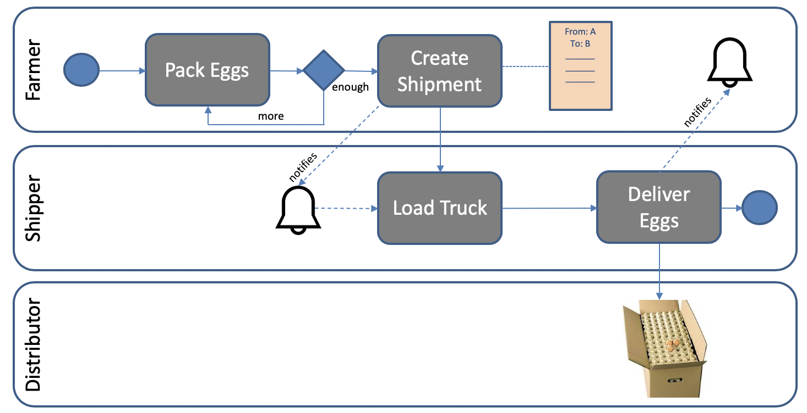
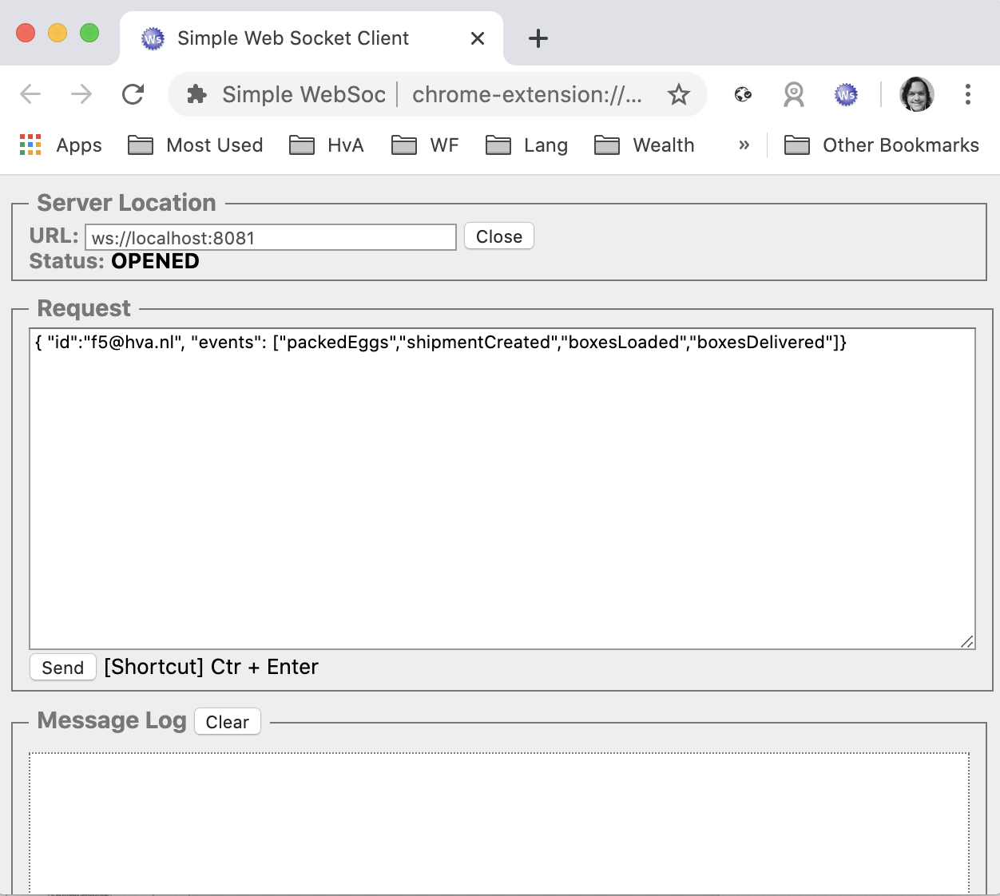

##  Blockchain Architecture :: Practicum

This project aims at covering the development process of a permissioned blockchain network using Hyperledger Fabric (HLF) version 2.5. 

## Objectives

- Understand how blockchain events can be triggered
- Understand how client applications could handle events

## Prerequisites

This development environment has many prerequisites. If you are willing to install everything in your local machine, follow the remaining steps. 

### Hyperledger Fabric

You must have the Hyperledger Development Environment configured in your machine or a spare Virtual Machine. If you do not have it yet, you can follow the instructions:

* Prerequisites (installation of cURL, Docker and Docker Composer, GO, NodeJS and NPM, Python, Git): [link](https://hyperledger-fabric.readthedocs.io/en/latest/prereqs.html)
* Install Samples, Binaries, and Docker Images: [link](https://hyperledger-fabric.readthedocs.io/en/latest/install.html)

### Visual Studio Code (Optional)

Visual Studio Code is a lightweight but powerful source code editor which runs on your desktop and is available for Windows, macOS and Linux. It comes with built-in support for JavaScript, the language used in this project to build smart contracts. 

You can download [Visual Studio code here](https://code.visualstudio.com/)

### Postman (Optional)

Postman is a collaboration platform for API development. In this exercise, Postman will be used as an HTTP client, allowing users to interact with the blockchain network using a REST-based API.

You can download [Postman here](https://www.postman.com/downloads/)

Alternatively, you can use a ready-to-use Linux Virtual Machine running on VirtualBox. More information can be found [here](https://gitlab.fdmci.hva.nl/blockchain/architecture/bc2-arch-week-1/-/blob/master/VM.md)

## The Use Case

The proposed use case is a simplified supply-chain process. An association of farmers, shippers and food distributors decided to optimise their businesses, creating a consortium. The consortium uses a private permissioned blockchain network to do their business.

To know more, go to the [use case section of the previous workshop](https://gitlab.fdmci.hva.nl/mfknr/bc2-arch-week-2#the-use-case)

## Network Configuration

### Creating the Fabric network

During this step, you will create a local Fabric network, based on the *test-network*. This network is deployed with Docker Compose. 

To get started, you should first clone this project into your local computer:

```
git clone https://gitlab.fdmci.hva.nl/mfknr/bc2-arch-week-3.git
```

You will see a folder structure with three elements:

* **chaincode**: The business logic of the blockchain network
* **client/backend**: A backend application that allows users to interact with the blockchain network through a REST interface
* **client/frontend2**: An Angular application that interacts with the backend
* **doc**: Some documentation elements

### Startup commands

In this step, you will start your blockchain network. You should follow these instructions:

1. Open a terminal screen

3. Go to `fabric-samples/test-network` folder, normally installed in the home folder of your file system

5. Execute the following command to create and start the blockchain network: 

```
./network.sh up createChannel -ca -s couchdb 
```

Where, the *up* command will start the network by using docker containers, the *createChannel* command will create the default channel *myChannel*, the *-ca* option will create certificate authorities for organisations 1 and 2, and the *-s couchdb* option enables the CouchDB database per peer. 

Note: At any time, you can stop the network by running `./network.sh down`. At the time of writing this tutorial, the Docker desktop version is 4.18.0. If the script is taking to long to finish, try to restart Docker.

The figure below illustrates the consortium components:


### Deploying the chaincode

A [chaincode](https://hyperledger-fabric.readthedocs.io/en/latest/developapps/contractname.html#chaincode) is a generic container for deploying code to a Hyperledger Fabric blockchain network. One or more related smart contracts are defined within a chaincode. Every smart contract has a name that uniquely identifies it within a chaincode. Applications access a particular smart contract within a chaincode using its contract name.

After you have used the network.sh startup command, you can deploy the chaincode on the channel using the following commands:

1. Go to fabric-samples/test-network
2. Execute the command:

```
./network.sh deployCC -ccn egg-tracking -ccp [base-folder]/bc2-arch-week-3/chaincode -ccv 1 -ccs 1 -ccl javascript
```

Where [base-folder] is the location where you cloned this project, egg-tracking is the name of the chaincode, the parameter -ccl javascript is the language used to write the chaincode. This example was built with javascript. The parameter -ccv 1 and -ccs 1 refers to the version and sequence. If you change something in your chaincode and wants to redeploy, you should increment these values.

## Client Interaction

In a typical business blockchain application, network participants invoke smart contracts by using a client. The client, in turn, is responsible for submitting the transaction to peers and return the response to the client. 

This example has a client that exposes a RESTful API to interact with a blockchain network. This approach is useful if you have a variety of clients like web applications, mobile applications, and IoT devices, for example. 

Now we are examining how to interact with the network.

### Getting acquainted with the client source-code

Using your editor, take a look at files at the *client/backend* folder. Spend some minutes getting acquainted with the folder structure.

* **src/app.js**: This source-code exposes the API. It uses the Express library to expose resources
* **src/fabric/network.js**: This source-code uses the Fabric API to connect to the network
* **config.json**: This file contains relevant information for the connection
* **package.json**: This file contains the required library to run the app.

A client needs some basic information to connect to the network. You will see that the file config.json is pointing to a [connection profile](https://hyperledger-fabric.readthedocs.io/en/latest/developapps/connectionprofile.html). Take some minutes to analyse this file.

### Installing client dependencies 

First, you should install the dependencies.

Using the terminal window, execute the following command in the **client/backend** folder:

```
npm --logevel=error install
```

This command will install all dependencies in the *node_modules* folder.

### Setting up HLF network configuration

Our client programs are using the test-network connection profile to connect to the network. All programs are using the FABRIC_PATH variable. Thus, by using your terminal, you should create the variable FABRIC_PATH pointing to the folder of your fabric-samples, for example:

```
export FABRIC_PATH=~/fabric-samples
```

### Adding the first user to the wallet

A [wallet](https://hyperledger-fabric.readthedocs.io/en/latest/developapps/wallet.html) contains a set of user identities. An application run by a user selects one of these identities when it connects to a channel. An application run by a user selects one of the available identities when it connects to a channel.

The administrator of an organisation can issue certificates to new users. You will need that to create the participants of the egg tracking network such as farmers, distributors and shippers. Thus, you should export the admin certificate to the **client/backend/wallet** folder. To do so, execute the following operation:

```
node src/enrollAdmin.js
```

This command logs in to the certificate authority of organisation 1 and download the certificate of the administrator of org1, and add it to the *wallet* folder. 

Note: If you run this command again, you should manually remove the previous certificate file of the admin user(*admin.id*). Otherwise, the system will generate an error message telling that the certificate already exists.

Now you are ready to run the application.

### Running the client

You can start the API by executing the following command in the *client/backend* folder:

```
npm start
```

This command will start an HTTP server running on port 8080.

### Using the RESTful API

To interact with the API, we recommend you using Postman (see the prerequisites section). 

To speed up your tests, you can import the following collection with all ready-made calls from Postman :

```
https://www.getpostman.com/collections/821537dcd9a9973d317e
```

Below, a summary of operations:

For each operation, analyse the source code and the changes in the world state and wallet produced by the API call.

```
Adding a participant

POST http://localhost:8080/rest/participants
{
   "id":"f5@hva.nl",
   "name":"Farmer 5",
   "role":"Farmer"
}
```
```
Packing Eggs

POST http://localhost:8080/rest/eggboxes
{
   "farmerId":"f5@hva.nl",
   "packingTimestamp":"20191224151230",
   "quantity":"30"
}
```
```
Creating a Shipment Request

POST http://localhost:8080/rest/shipments
{
   "farmerId":"f5@hva.nl",
   "shipperId":"s5@hva.nl",
   "distributorId":"d5@hva.nl",
   "shipmentCreation":"20191124154531",
   "min":"1",
   "max":"30"
}
```
```
Loading Boxes (see :shipmentId parameter)

POST http://localhost:8080/rest/shipments/:shipmentId/load
{
   "shipperId":"s5@hva.nl",
   "loadTimestamp":"20191124163412"
}
```
```
Delivering Boxes (see :shipmentId parameter)

POST http://localhost:8080/rest/shipments/:shipmentId/delivery
{
   "shipperId":"s5@hva.nl",
   "deliveryDate":"20191124172243"
}
```
```
Reporting Damaged Box (see :eggBoxId parameter)

PUT http://localhost:8080/rest/eggboxes/:eggBoxId/damaged
{
   "participantId":"s5@hva.nl"
}
```

### Handling Events

Hyperledger Fabric supports listening for a variety of events triggered by the blockchain network. Examples are block generation events, transaction events, and chaincode events.

During this session, we are exploring chaincode events. These type of events are particularly interesting because many business processes can be started after some event is triggered. E.g. the payment process is triggered after the payment. 

This example illustrates chaincode events generated in specific moments of the egg tracking application. For example, the shipper should be notified when a shipment is ready. Also, the distributor should be notified when the truck is loaded.

The figure below illustrates the consortium components:



The example application triggers the following events:

- packedEggs
- shipmentCreated
- boxesLoaded
- boxesDelivered

Take some time to analyse the source-code of the smart contract.

In this application, the backend client is responsible for listening for events using the Fabric Client API. The backend client deliver the event to the front-end application using a websocket. A websocket is a convenient bidirectional communication channel between the browser and the server. 

To test how websocket messages are delivered in this example, do the following:

* Use a websocket client. We recommend you downloading the [Simple WebSocket client Extension from Chrome](https://chrome.google.com/webstore/detail/simple-websocket-client/pfdhoblngboilpfeibdedpjgfnlcodoo?hl=en)
* Using the extension, try to connect to the server by providing the address ws://localhost:8081
* Send a message to the websocket server, specifying your identity and which events you are interested in. For example:

```
{ "id":"s5@hva.nl", "events": ["packedEggs","shipmentCreated","boxesLoaded","boxesDelivered"]}
```

The figure below shows an example of usage:



Use POSTMAN to create some egg packages using the same farmer registered previously. You should receive an event specifying that a package was created.

### Using the Frontend application

We have build a simple front-end application to demonstrate how event handling can be managed in the client-side by using websockets.

You should install Angular first. If you do not have it yet, run the following command in your terminal:

```
npm --logevel=error install -g @angular/cli
```

More information about the Angular environment can be [found here](https://angular.io/guide/setup-local).

To run the application, you should first install dependencies in the root folder of the front-end application.

```
npm --logevel=error install
```

Then, you can start a local server, by running this command in the root folder of the front-end application.

```
ng serve
```

After start-up you can access the application from [http://localhost:4200](http://localhost:4200).

You can see packaging, loading, shipment events on the screen. The client is only reading data. Thus, you should use Postman in parallel to execute the transactions.
