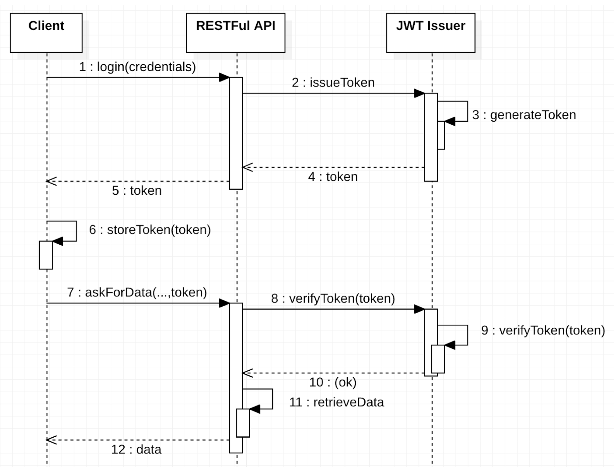

##  Blockchain Architecture :: Practicum Week 4

This project aims at covering the development process of a security layer of the RESTful API that connects to the Blockchain. 

## Objectives

- Build the security layer and wallet management of the client application
- Understand the basics of token-based authentication and authorisation

## Prerequisites

This development environment has many prerequisites. If you are willing to install everything in your local machine, follow the remaining steps. 

### Hyperledger Fabric

You must have the Hyperledger Development Environment configured in your machine or a spare Virtual Machine. If you do not have it yet, you can follow the instructions:

* Prerequisites (installation of cURL, Docker and Docker Composer, GO, NodeJS and NPM, Python, Git): [link](https://hyperledger-fabric.readthedocs.io/en/latest/prereqs.html)
* Install Samples, Binaries, and Docker Images: [link](https://hyperledger-fabric.readthedocs.io/en/latest/install.html)

### Visual Studio Code (optional)

Visual Studio Code is a lightweight but powerful source code editor which runs on your desktop and is available for Windows, macOS and Linux. It comes with built-in support for JavaScript, the language used in this project to build smart contracts. 

You can download [Visual Studio code here](https://code.visualstudio.com/)

### Postman (optional)

Postman is a collaboration platform for API development. In this exercise, Postman will be used as an HTTP client, allowing users to interact with the blockchain network using a REST-based API.

You can download [Postman here](https://www.postman.com/downloads/)

### Docker Extension for VS Code (optional)

Another helpful tool that can be used together with Visual Studio Code is the *Docker Extension*. You can start, stop, inspect, and interact with docker containers using the visual interface.

In VS Code, use the menu option *Preferences > Extensions* and look for "Docker" and click the Install button.

Alternatively, you can use a ready-to-use Linux Virtual Machine running on VirtualBox. More information can be found [here](https://gitlab.fdmci.hva.nl/blockchain/architecture/bc2-arch-week-1/-/blob/master/VM.md)

## The Use Case

The proposed use case is based a simplified supply-chain process. An association of farmers, shippers and food distributors decided to optimise their businesses, creating a consortium. The consortium uses a private permissioned blockchain network to do their business.

To know more you can go to the [use case section of the previous workshop](https://gitlab.fdmci.hva.nl/blockchain/architecture/bc2-arch-week-3)

### Securing the Middleware Layer

A blockchain network aims at connecting organizations, allowing participants to transfer assets between each other. To do so, they submit transactions, and those transactions are recorded in an immutable ledger.

Your blockchain network should allow the integration with external systems. One solution would be to interact with the Hyperledger Client API directly or by exposing a middleware service.

A REST-based middleware service might contain a set of REST endpoints to interact with the Blockchain network. As a consequence, the endpoints can then be called directly by the external system (or client application). When the client application calls one of the REST endpoints, the REST server will then submit a transaction to the Blockchain. This transaction must be signed by a certificate to say which identity is being used to submit the transaction. 

The REST server should be configured to use authentication. It allows a client application to authenticate with the REST server and then the REST server can distinguish between each of the clients. However this still doesn’t allow the Blockchain to distinguish between clients. The REST server will still sign each transaction with the same certificate. To enable the REST server to sign each transaction with a different identity per authenticated client the REST server must be configured to use multi-user mode. 

Each authenticated client will then have a private wallet on the REST server that contains the identity that will be used to sign the transaction on behalf of the different authenticated clients. This example shows how to configure the REST server for multi-user mode and how it can be called from a client application to add participants and identities and how to submit transactions that are signed by different identities. The client app is written using Angular and will use Google authentication to authenticate itself with the REST server.

Let's now start to explore the example application.


An authentication strategy should be used. In this example we are using Google OAuth2.0 authentication.


## Network Configuration

### Creating the Fabric network

During this step, you will create a local Fabric network, based on the *test-network*. This network is deployed with Docker Compose. 

To get started, you should first clone this project into your local computer:

```
git clone git@gitlab.fdmci.hva.nl:blockchain/architecture/bc2-arch-week-4.git
```

You will see a folder structure with three elements:

* **chaincode**: The business logic of the blockchain network
* **client/backend**: A backend application that allows users to interact with the blockchain network through a REST interface
* **client/frontend**: An Angular application that interacts with the backend
* **doc**: Some documentation elements

### Startup commands

In this step, you will start your blockchain network. You should follow these instructions:

1. Open a terminal screen

3. Go to `fabric-samples/test-network` folder, normally installed in the home folder of your file system

5. Execute the following command to create and start the blockchain network: 

```
./network.sh up createChannel -ca -s couchdb 
```

Where, the *up* command will start the network by using docker containers, the *createChannel* command will create the default channel *myChannel*, the *-ca* option will create certificate authorities for organisations 1 and 2, and the *-s couchdb* option enables the CouchDB database per peer. 

Note: At any time, you can stop the network by running `./network.sh down`. At the time of writing this tutorial, the Docker desktop version is 4.18.0. If the script is taking to long to finish, try to restart Docker.

The figure below illustrates the consortium components:


### Deploying the chaincode

A [chaincode](https://hyperledger-fabric.readthedocs.io/en/latest/developapps/contractname.html#chaincode) is a generic container for deploying code to a Hyperledger Fabric blockchain network. One or more related smart contracts are defined within a chaincode. Every smart contract has a name that uniquely identifies it within a chaincode. Applications access a particular smart contract within a chaincode using its contract name.

After you have used the network.sh startup command, you can deploy the chaincode on the channel using the following commands:

1. Go to fabric-samples/test-network
2. Execute the command:

```
./network.sh deployCC -ccn egg-tracking -ccp [base-folder]/bc2-arch-week-4/chaincode -ccv 1 -ccs 1 -ccl javascript
```

Where [base-folder] is the location where you cloned this project, egg-tracking is the name of the chaincode, the parameter -ccl javascript is the language used to write the chaincode. This example was built with javascript. The parameter -ccv 1 and -ccs 1 refers to the version and sequence. If you change something in your chaincode and wants to redeploy, you should increment these values.


## OAuth2.0 configuration

For this workshop you will need a Google Account. 

1. Open the [Google APIs & Services Console](https://console.cloud.google.com/projectselector2/apis/dashboard?supportedpurview=project)
2. To access the OAuth2.0 feature, you should create a project. You can click the "create project" button to inform your project details
3. Go to **Credentials**
4. Select *Create Credentials* > *OAuth Client ID*. To use this feature, you should configure a consent screen. You can choose for an external account, and fill basic information such as the application name, and contact information.
4. Back to the Create Credentials, select Web Application
5. Give a name to the Web Application
6. Inform *http://localhost:4200* in Authorised JavaScript origins field
7. Inform *http://localhost:4200/auth/google/callback* in the Authorised redirect URIs field
8. A new configuration will be created and shown in the table
9. Select the download option of the newly created config. A JSON file will be generated
10. Move this file to the */client/backend/src/auth* folder with the name **oauth2.keys.json**

## Client Interaction

The client that exposes a RESTful API to interact with a blockchain network. This approach is quite useful if you have a variety of clients like web applications, mobile applications, and IoT devices. Now, an additional security layer was added.

When the REST server is started, all HTTP/S requests made by clients must be followed by an authentication token provided via OAuth2.0. This token is signed by the provider (Google for this workshop). 

Please note that this feature requires that clients trust the REST server. This trust is required because this feature requires that the REST server stores the clients' Blockchain identities, including the private keys. Therefore, it is strongly recommended that clients only use REST servers that are managed by a trusted party, such as an administrator within their organization.

### Installing client dependencies 

First, you should install the dependencies.

Using the terminal window, execute the following command in the **client/backend** folder:

```
npm --logevel=error install
```

This command will install all dependencies in the *node_modules* folder.

### Setting up HLF network configuration

Our client programs are using the test-network connection profile to connect to the network. All programs are using the FABRIC_PATH variable. Thus, by using your terminal, you should create the variable FABRIC_PATH pointing to the folder of your fabric-samples, for example:

```
export FABRIC_PATH=~/fabric-samples
```

### Adding the first user to the wallet

The administrator of an organisation can issue certificates to new users. You will need that to create the participants of the egg tracking network such as farmers, distributors and shippers. Thus, you should export the admin certificate to the **client/backend/wallet** folder. To do so, execute the following operation:

```
node src/enrollAdmin.js
```

This command logs in to the certificate authority of organisation 1 and download the certificate of the administrator of org1, and add it to the *wallet* folder. 

Note: If you run this command again, you should manually remove the previous certificate file of the admin user(*admin.id*). Otherwise, the system will generate an error message telling that the certificate already exists.

Now you are ready to run the application.

### Running the client

To start the server use the following command:

```
npm start
```

It will start a server running on port 8080.

### Using the Client API

We have build a simple front-end application to demonstrate how event handling can be managed in the client-side.

You should install Angular first. If you do not have it yet, run the following command in your terminal:

```
npm install -g @angular/cli
```

More information about the Angular environmentcan be [found here](https://angular.io/guide/setup-local).

To run the application, you should first install dependencies in the root folder of the front-end application.

```
npm --logevel=error install
```

Then, you can start a local server, by running this command in the root folder of the front-end application.

```
ng serve
```

After start-up you can access the application from [http://localhost:4200](http://localhost:4200).

You will see that the sign-up feature was removed. Instead, the login feature will play this role, redirecting you to the Google Authentication Screen. If this is the first time you are using the account, the application will ask to associate the Google Account with a new identity. To create the identity, the role should also be specified (farmer, shipper or distributor). 

The home page will show the generated Json Web Token. It will be useful for making POSTMAN calls in this workshop.

### Using the RESTful API

To interact with the API, we recommend you using Postman (see the prerequisites section). 

To speed up your tests, you can import the following collection with all ready-made calls from Postman :

```
https://www.getpostman.com/collections/6d4e1a07d73916ffd227
```

Below, a summary of operations:

For each operation, analyse the source code and the changes in the world state and wallet produced by the API call. 

> Do not forget to add the token when making requests. You can use the Authorization Tab > Bearer Token and paste the token to make requests. If the token was not provided or is invalid, a 401 message will be returned.

The following diagram presents an overview of a typical token-based workflow.



```
Packing Eggs

POST http://localhost:8080/rest/eggboxes
{
   "farmerId":"eggtrackingf1@gmail.com",
   "packingTimestamp":"20191224151230",
   "quantity":"30"
}
```
```
Creating a Shipment Request

POST http://localhost:8080/rest/shipments
{
   "farmerId":"eggtrackingf1@gmail.com",
   "shipperId":"eggtrackings1@gmail.com",
   "distributorId":"eggtrackingd1@gmail.com",
   "shipmentCreation":"20191124154531",
   "min":"1",
   "max":"30"
}
```
```
Loading Boxes (see :shipmentId parameter)

POST http://localhost:8080/rest/shipments/:shipmentId/load
{
   "shipperId":"eggtrackings1@gmail.com",
   "loadTimestamp":"20191124163412"
}
```
```
Delivering Boxes (see :shipmentId parameter)

POST http://localhost:8080/rest/shipments/:shipmentId/delivery
{
   "shipperId":"eggtrackings1@gmail.com",
   "deliveryDate":"20191124172243"
}
```
```
Reporting Damaged Box (see :eggBoxId parameter)

PUT http://localhost:8080/rest/eggboxes/:eggBoxId/damaged
{
   "participantId":"eggtrackingd1@gmail.com"
}
```

