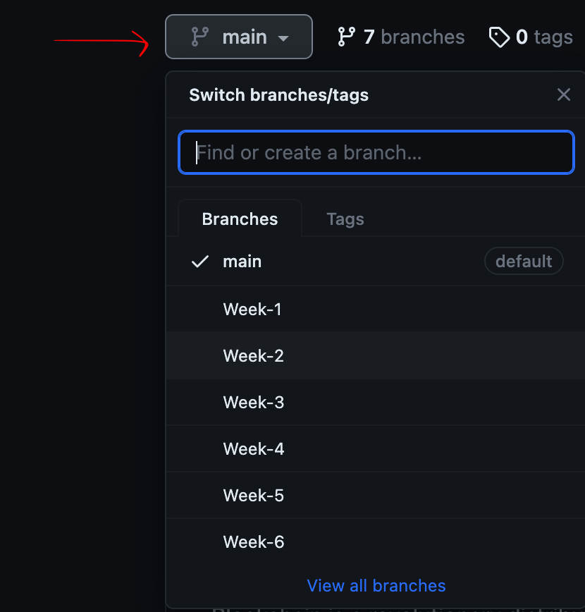

# Welcome to Blockchain Architecture course!

Welcome to the world of blockchain architecture! This repository plays a vital role in understanding and harnessing the potential of blockchain technology. This course is designed for the minor Blockchain at the Amsterdam University of Applied Science.

Blockchain is a revolutionary distributed ledger technology that has transformed the way transactions are conducted. Its profound impact on the software industry calls for a proactive approach, empowering professionals to develop tools and techniques rooted in blockchain principles and seamlessly integrate blockchain into their projects.

Our course delves into the essential aspects of blockchain architecture and the technical knowledge necessary for blockchain developers. We equip you with the expertise required to make critical architectural decisions when defining and designing blockchain-based projects.

## Weekly Curriculum

| Week | Topic                                |
|------|--------------------------------------|
| 1    | Data and Transaction Model           |
| 2    | Use Case Selection / Network Participants |
| 3    | Identity                             |
| 4    | System Integration                    |
| 5    | Architecture - External Calls         |
| 6    | Platform and Host Decisions           |

## Course Content

Throughout the duration of this course, a branch will be created for each week. These branches will contain assignments and associated files, facilitating your learning journey. You can find the content here

## Assessment

This course covers the architectural design choices that must be made by team members while designing a software system using a blockchain. The project group should create a permissioned blockchain network using Hyperledger Fabric. The case study should be defined by the group and defended in week 2 to get approval from the lecturer.

Students will demo their proof-of-concept in and deliver a report describing the experiment, with the following topics.

 - Use Case Description
 - Data and transaction model
 - How participants, assets and transactions were modelled?
 - Logic (Smart Contracts)
 - What are the business rules?
 - Which types of events are generated, and who consumes such events?
 - Privacy and Security
 - Authentication and Authorisation
 - Integration
 - How does the blockchain network interact with external systems (calls and events)?
 - Architecture organisation
 - How many peers and organisations?
 - How does consensus/endorsement work in your network
 - Network hosting
 - What is the chosen hosting strategy?

